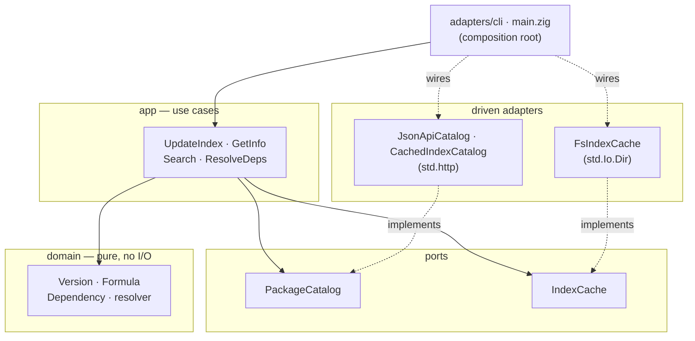

<div align="center">

# 🍺 metalbrew

**Homebrew, rebuilt in Zig — no Ruby, no runtime, one static binary.**

[](https://github.com/4thel00z/metalbrew/actions/workflows/ci.yml)
[](https://ziglang.org/)
[](LICENSE)
[](#requirements)

</div>

---

metalbrew is a from-scratch reimplementation of the [Homebrew](https://brew.sh) package manager in Zig. It talks to the public `formulae.brew.sh` JSON API, resolves transitive dependencies, and pours prebuilt bottles — without a Ruby interpreter, a garbage collector, or a megabyte of runtime. Just a single relocatable binary.

> **Status — M1 (read-only spine) is complete.** `update`, `info`, `search`, and `deps` work end-to-end against the live index. Bottle installation (`install`/`uninstall`/`list`) lands in M2; `upgrade` in M3. See the [roadmap](#roadmap).

## Why

Homebrew is Ruby all the way down: formulae are arbitrary Ruby executed by a bundled `brew` runtime. metalbrew takes the other road — treat the prebuilt JSON index and bottles as the contract, and implement the client in a language that compiles to a tiny dependency-free executable. The result starts instantly and ships as one file.

## Features

- **Pure Zig HTTP + TLS** — fetches the index over `std.http`, no `curl`, no libssl.
- **Transitive dependency resolution** — topological order, cycle detection, build-dep filtering.
- **Local index cache** — `update` once, then `info`/`search`/`deps` work offline.
- **Own prefix, zero sudo** — installs under `~/.metalbrew`, never touches a real Homebrew.
- **Hexagonal architecture** — a pure domain core behind ports; adapters for HTTP, the filesystem, and the CLI are swappable and independently tested.

## Requirements

- **Zig 0.16.0**
- **macOS arm64** (Apple Silicon) — the only target for now; bottle relocation is Mach-O specific.

## Install

```sh
git clone https://github.com/4thel00z/metalbrew.git
cd metalbrew
zig build           # produces ./zig-out/bin/metalbrew
```

## Usage

```sh
# Download and cache the formula index (~30 MB)
metalbrew update

# Show a formula's metadata
metalbrew info wget
#   wget: 1.25.0
#   Internet file retriever
#   Dependencies: libidn2, openssl@3, gettext, libunistring, pkgconf

# Search formula names
metalbrew search wget
#   wget
#   wget2
#   wgetpaste

# Print the transitive runtime dependencies, in install order
metalbrew deps wget
#   libunistring
#   gettext
#   libidn2
#   ca-certificates
#   openssl@3
```

The prefix defaults to `~/.metalbrew`; override it with `METALBREW_PREFIX`.

## Architecture

metalbrew follows a strict ports-and-adapters layering. The domain has zero I/O and depends on nothing outward; use-cases orchestrate it through ports; adapters and the composition root live at the edge.



| Layer | Path | Responsibility |
|------|------|----------------|
| Domain | `src/domain/` | Value objects + dependency resolution. Pure. |
| Ports | `src/ports/` | Interfaces the app needs (`PackageCatalog`, `IndexCache`). |
| App | `src/app/` | Use-cases: `update`, `info`, `search`, `deps`. |
| Adapters | `src/adapters/` | HTTP, filesystem, JSON parsing, CLI. |
| Composition | `src/main.zig` | Wires concrete adapters to use-cases. |

## Roadmap

- [x] **M1 — Read-only spine** · index fetch + cache, `update` / `info` / `search` / `deps`, transitive resolution
- [ ] **M2 — Install pipeline** · ghcr.io bottle fetch + sha256 verify, Mach-O relocation, ad-hoc re-sign, keg linking, receipts; `install` / `uninstall` / `list`
- [ ] **M3 — Upgrade** · version-diff installed vs index, reinstall newer; `upgrade`

## Development

```sh
zig build test --summary all          # run the suite (network tests skip on failure)
METALBREW_SKIP_NET=1 zig build test    # force-skip the two opt-in network tests
```

## License

[MIT](LICENSE) © 4thel00z
