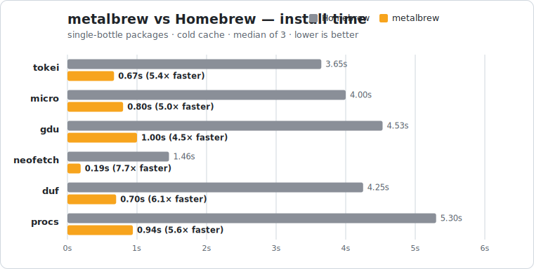

<p align="center">
  
</p>

<h1 align="center">metalbrew</h1>

<p align="center">
  <strong>Homebrew, rebuilt in Zig — no Ruby, no runtime, one static binary.</strong>
</p>

<p align="center">
  <a href="https://github.com/4thel00z/metalbrew/actions/workflows/ci.yml"></a>
  <a href="https://ziglang.org/"></a>
  <a href="LICENSE"></a>
  
</p>

---

## Motivation

Homebrew is Ruby all the way down — formulae are arbitrary Ruby run by a bundled interpreter. metalbrew takes the other road: treat the prebuilt `formulae.brew.sh` JSON index and bottles as the contract, and ship the client as one tiny, dependency-free binary that starts instantly. No Ruby, no GC, no runtime.

## Benchmarks

<p align="center">
  
</p>

Installing single-bottle packages (macOS arm64, cold cache, median of 3 runs). Identical work each side — fetch, verify, extract, link one bottle:

| Package | Homebrew | metalbrew | speedup |
|---------|---------:|----------:|--------:|
| tokei    | 3.65s | 0.67s | **5.4×** |
| micro    | 4.00s | 0.80s | **5.0×** |
| gdu      | 4.53s | 1.00s | **4.5×** |
| neofetch | 1.46s | 0.19s | **7.7×** |
| duf      | 4.25s | 0.70s | **6.1×** |
| procs    | 5.30s | 0.94s | **5.6×** |
| **mean** | **3.87s** | **0.72s** | **~5.4×** |

The gap is manager overhead: Homebrew shells out to Ruby and runs post-install hooks per package; metalbrew is one static binary. On large multi-bottle trees the wall-clock converges (downloads dominate), but metalbrew stays ahead per bottle.

```bash
./bench/bench.sh             # Track A — zero-dep packages, fully reversible
./bench/bench.sh --with-deps # also time full dependency trees (see script header)
python3 bench/plot.py        # regenerate docs/benchmark.svg from bench/results.tsv
```

## Installation

```bash
git clone git@github.com:4thel00z/metalbrew.git
cd metalbrew
make install
```

Builds a release binary and drops `metalbrew` into `~/.local/bin`. Set `PREFIX` to install elsewhere (`make install PREFIX=/usr/local`).

## Usage

```bash
metalbrew update            # download + cache the formula index
metalbrew info wget         # name, version, description, dependencies
metalbrew search wget       # search formula names
metalbrew deps wget         # transitive runtime deps, in install order
metalbrew install wget      # fetch + verify + relocate + link a bottle (with deps)
metalbrew list              # list installed packages
metalbrew uninstall wget    # unlink + remove an installed package
metalbrew upgrade [wget]    # upgrade all installed packages, or just one
```

The prefix defaults to `~/.metalbrew`; override with `METALBREW_PREFIX`.

## Development

```bash
make            # list all targets
make test       # full suite (network tests skip on failure)
make check      # format check + offline tests (CI-style)
```

Requires **Zig 0.16.0** on **macOS arm64**.

## License

[MIT](LICENSE) © 4thel00z
